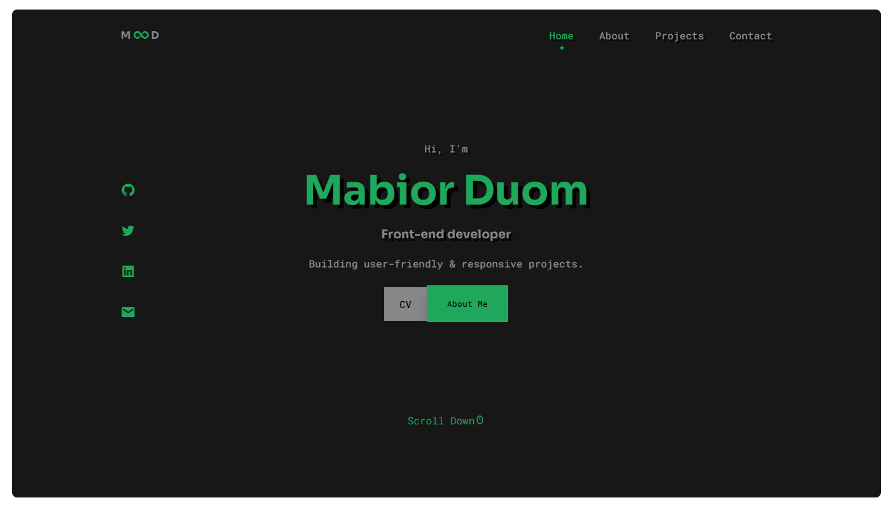

<h1 align="center">mabior - v1</h1>

First iteration of my personal portfolio built with HTML, CSS and JAVASCRIPT

  
  
  
  
  

  <a href="https://mde3.github.io/mabior-v1/"><strong>➥ Live Demo</strong></a>

### Overview
- Developed using Mobile First Approach.
- Responsive on all devices.
- SEO optimized.

## License
Distributed under the MIT License - see [LICENSE](LICENSE) file for details.
